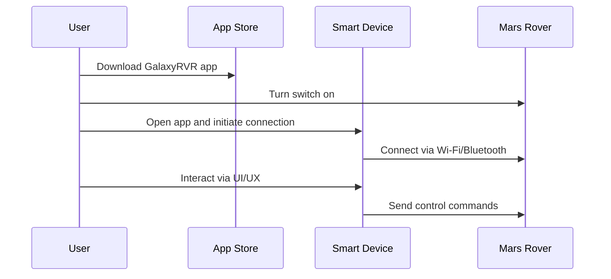

# Operational scenario: First-time connection and control of the Mars Rover via mobile app.

## First Steps:

1. **Download the APP**: Download the SunFounder GalaxyRVR app from the app store on your smart device.
2. **Turn the switch on**: Power on the Mars Rover by turning the switch to the ON position.
3. **Connect your smart device to the Mars Rover**: Use the app to scan for and connect to the Mars Rover's Wi-Fi or Bluetooth signal.
4. **Use the UI/UX for interaction**: Once connected, utilize the app's interface to control and interact with the Mars Rover.

## Sequence Diagram

For detailed instructions, refer to the official documentation: [SunFounder GalaxyRVR Documentation](https://docs.sunfounder.com/projects/galaxy-rvr)

